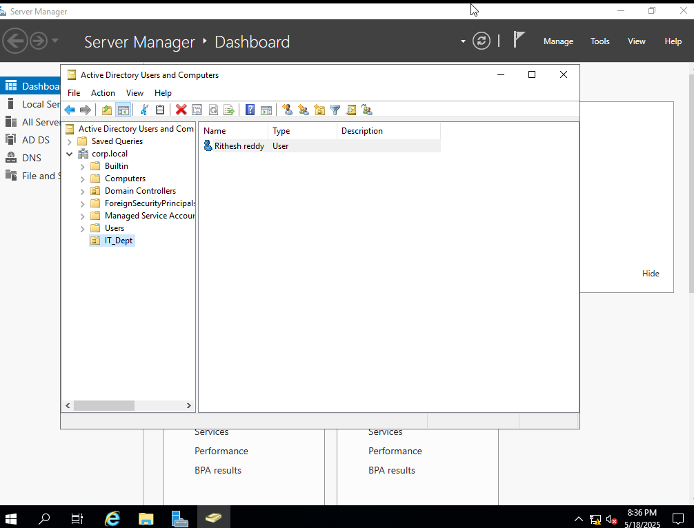

# 🖥️ Windows Server & Active Directory Lab

A VMware-based lab environment using Windows Server 2019 to simulate a Domain Controller (DC) with DNS, AD DS, and user/OU management.

---

## 📁 Project Contents

| File Name                        | Description                                      |
|----------------------------------|--------------------------------------------------|
| `ad-ds-installed.png`            | AD DS role installation via Server Manager      |
| `ad-users-ou.png`               | OU and user created in Active Directory         |
| `domain-promotion-corp-local.png`| Domain promotion wizard to `corp.local`         |
| `ipconfig.txt`                  | Output of server's static IP configuration      |
| `notes.txt`                     | Setup notes and troubleshooting log             |
| `rename-srv-dc01.png`           | Server renamed to `SRV-DC01`                    |
| `server-desktop.png`            | Initial Windows Server desktop after setup      |
| `static-ip-settings.png`        | IPv4 static IP settings window                  |

---

## 🛠️ Lab Summary

- **Server OS**: Windows Server 2019 (Standard with Desktop Experience)
- **Platform**: VMware Workstation 16 Player
- **Domain Name**: `corp.local`
- **Server Hostname**: `SRV-DC01`
- **Static IP**: `192.168.100.10`
- **User Created**: `rithesh.reddy`
- **OU Created**: `IT_Dept`

---

## 📸 Screenshots

### 🔹 1. Server Desktop After First Login

---

### 🔹 2. Renaming Server to SRV-DC01

---

### 🔹 3. Static IP Configuration

---

### 🔹 4. Active Directory Domain Services Installed

---

### 🔹 5. Domain Promotion to `corp.local`

---

### 🔹 6. OU & User Created in ADUC

---

## 📄 Configuration Files

- [`ipconfig.txt`](./ipconfig.txt): IP setup details
- [`notes.txt`](./notes.txt): Setup notes & issues resolved

---

## 📚 Learning Outcomes

- Installed and configured AD DS
- Promoted the server to a domain controller
- Managed domain users and OUs
- Practiced static IP and DNS configuration in an enterprise-style setup

---

## 👨‍💻 Author

**Rithesh Reddy Baroor**  
📬 rbaroor22533@ucumberlands.edu  
🔗 [LinkedIn](https://www.linkedin.com/in/ritheshreddy16)

---
